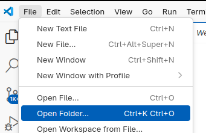

# Code development

## Development environment
By far the easiest way to work on the remote `nectar` cluster is to install [Visual Studio Code](https://code.visualstudio.com/) on your laptop. It is available for Windows, Mac, Linux.

Once installed and started, go down to extensions and install [Remote - SSH](https://marketplace.visualstudio.com/items?itemName=ms-vscode-remote.remote-ssh),  [Python](https://marketplace.visualstudio.com/items?itemName=ms-python.python) and [Jupyter](https://marketplace.visualstudio.com/items?itemName=ms-toolsai.jupyter) 
Just search for the names in the extension tab as shown below, click on it and install.
  


> **Note:**  
> As always be careful when you install software. Check that all the etension above have the `microsoft.com` badge on them before you click install. For other extensions do your due diligence. Do they have millions of installations, is it a case of typo squatting, read the reviews!

After installing the extensions, you can now connect to the `nectar` cluster by clicking on the small set of arrows in the very bottom left of the window, then select `Connect to Host ...` and pick `nectar9` from the list. It should now open a new window where you now work on the remote `nectar9` machine. If `nectar9` is not in the list, something has been missed in the [section on obtaining an account](#obtain-an-account). The first time you connect, you might have to pick `linux` as the type for the remote.

 .

## Setup your coding area
For a given project, you only need to do everything below once.

LHCb has created an [Analysis Repository Skeleton](https://gitlab.cern.ch/lhcb-dpa/wp6-analysis-preservation-and-open-data/analysis-repo-skeleton) which provides a great place for you to start developing your code. When you eventually has to share your code with somebody else, then it becomes much easier if they see a familiar structure.
1. Follow the instructions to [set up the repository](https://gitlab.cern.ch/lhcb-dpa/wp6-analysis-preservation-and-open-data/analysis-repo-skeleton#to-set-up-the-repository)
2. [download a local copy](https://gitlab.cern.ch/lhcb-dpa/wp6-analysis-preservation-and-open-data/analysis-repo-skeleton#download-your-replica-project-locally). The commands in the last step should be executed in a terminal window on `nectar9`, see images. 

! 

.
3. You can ignore the rest of the instructions on the [Analysis Repository Skeleton](https://gitlab.cern.ch/lhcb-dpa/wp6-analysis-preservation-and-open-data/analysis-repo-skeleton) page now and come back to it later if required.
4. To setup the python environment for coding, in a terminal window inside your skeleton directory set up a virtual environment that is based on the shared LHCb conda environment.
```
lb-conda-dev virtual-env default/2025-07-31 lb-python
```
5. Now in the MVC window open the skeleton folder .
6. Type `ctrl-shift-p` and at the prompt type `Python: Select Interpreter` and then pick the line that has `lb-python` in it.

> **Note:**  
> If you do not yet have a computing account at CERN, you should just ignore step 1 above and in step 2, replace the `git clone` command with
> ```
> git clone https://gitlab.cern.ch/lhcb-dpa/wp6-analysis-preservation-and-open-data/analysis-repo-skeleton.git

## Edit and run a Jupyter notebook
To edit a Jupyter notebook, create a new file with the extension `.ipynb` in the `python` folder inside your skeleton project. To select the kernel, pick `Python environments` and then the `lb-python` option. You can try the following script. If it runs and produce a histogram, everything is good.
```python
import ROOT
import numpy as np

# Generate random numbers
data = np.random.normal(loc=0, scale=1, size=1000)

# Create a ROOT histogram
hist = ROOT.TH1F("hist", "Random Numbers Histogram", 50, -4, 4)

# Fill the histogram
for value in data:
    hist.Fill(value)

# Draw the histogram
canvas = ROOT.TCanvas("canvas", "Canvas", 800, 600)
hist.Draw()
canvas.Draw()
```
If you see red wiggly lines under the packages that you import, you might have done something wrong with setting up the environment or with selecting the kernel.
