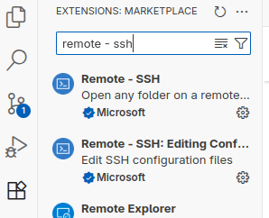

# Nectar computing cluster
The group has access to a comouting cluster for performing simulations and analysis of LHCb data. It is configured to be as identical as possible to the `lxplus` machines at CERN. It is a linux cluster that you access via `ssh`.

In general, anything you read in the [StarterKit](https://lhcb-starterkit-run3.docs.cern.ch/) to do on `lxplus` can be done on the `nectar` cluster as well.

## Obtain an account
Logins to the cluster can only happen via using an `ssh` keypair. This is similar to the passkey methods that are used on many websites. On your Windows/Mac/linux laptop, open a terminal (command) window. In that one type `ssh-keygen`. Accept the default name and then provide a password that is at least 12 characters long. The program will report that it writes two files into the hidden `.ssh` folder below your home folder. Via either email or Slack send the content of the files ending in `.pub` to your supervisor who will then forward it to Ulrik.

Wait for Ulrik to tell you that the account is ready and give you a username. Then create (or edit if already there) a file called `config` in the hidden `.ssh` folder inside your home folder. In it put the content
```sshconfig
Host nectar9
     User <user>
     PubkeyAuthentication yes
     IdentityFile ~/.ssh/<keyfile>
     ProxyJump frontend

Host frontend
     User <user>
     PubkeyAuthentication yes
     IdentityFile ~/.ssh/<keyfile>
     Hostname frontend.lhcb-simulation.cloud.edu.au
```
where you replace `<user>` with the username you are given and `<keyfile>` is the name of the file that doesn't have the `.pub` extension.

Now from the terminal (command) window try
```bash
ssh nectar9
```
and confirm that it logs you in. If it doesn't work, do 
```bash
ssh -vvv nectar9
```
ask for help, including the output of the last command.

## Disk space
On the `nectar` cluster you have a home directory at `/home/<user>`. You are the only one who can read content in that directory. To share data with other users, create a directory below `/shared` that has an explaining name. Everybody on the cluster will hav access to those files.

Be aware that there is **no backup** and **no undo** of files you delete, or indeed everything if there is a disk failure. For code, you should use GitHub/Gitlab or similar to track your changes and for data, it should either be available elsewhere or should be relatively easy to recreate.

## Code development
By far the easiest way to work on the remote `nectar` cluster is to install [Visual Studio Code](https://code.visualstudio.com/) on your laptop. Once installed and started, install the extension [Remote - SSH](https://code.visualstudio.com/docs/remote/ssh). Just search for it in the extensions and shown below, click on it and install.
  


You can now connect to the `nectar` cluster by clicking on the small set of arrows in the very bottom left of the VSC widow.

